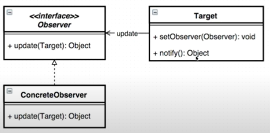

## Java Design Pattern


## 옵저버 패턴 (Observer Pattern)

> 데이터의 변경이 발생했을 경우, 상대 클래스나 객체에 **의존하지 않으면서** 데이터 변경을 통보하고자 할 때 유용하다.
>
> 즉, 이벤트 발생 후 객체 외부에서 처리한다.



`Target` 객체가 `Observer` 인터페이스를 가지고 있어서 `notify`에서 `update`를 호출해서 `Target` 객체에서 `이벤트가 처리되는 것을 확인`한다.

```java
public class Button {
    
    // notify
    public void onClick(){
        // 이벤트 처리를 해줘야 한다.
        // onClickListener 왔을때 호출
        if (onClickListener != null) {
            onClickListener.onClick(this); 
            // 클릭이벤트가 발생하면 자기자신을 업데이트 한다.
        }
    }

    // Observer Interface
    public interface OnClickListener{
        public void onClick(Button button);
    }

    private OnClickListener onClickListener;

    // setObserver
    public void setOnClickListener(OnClickListener onClickListener) {
        this.onClickListener = onClickListener; // 객체를 넣어준다.
    }
}
```

```java
public class Main {
    public static void main(String[] args) {
        System.out.println();

        Button button = new Button(); // 버튼 객체를 만든다.
        
        button.setOnClickListener(new Button.OnClickListener() {
            @Override
            public void onClick(Button button) {
                System.out.println(button+"is Clicked"); // 버튼객체가 클릭된다.
            }
        });
        button.onClick();
    }
}
```


자바 제공

`Observer` 인터페이스

`Observable` 클래스